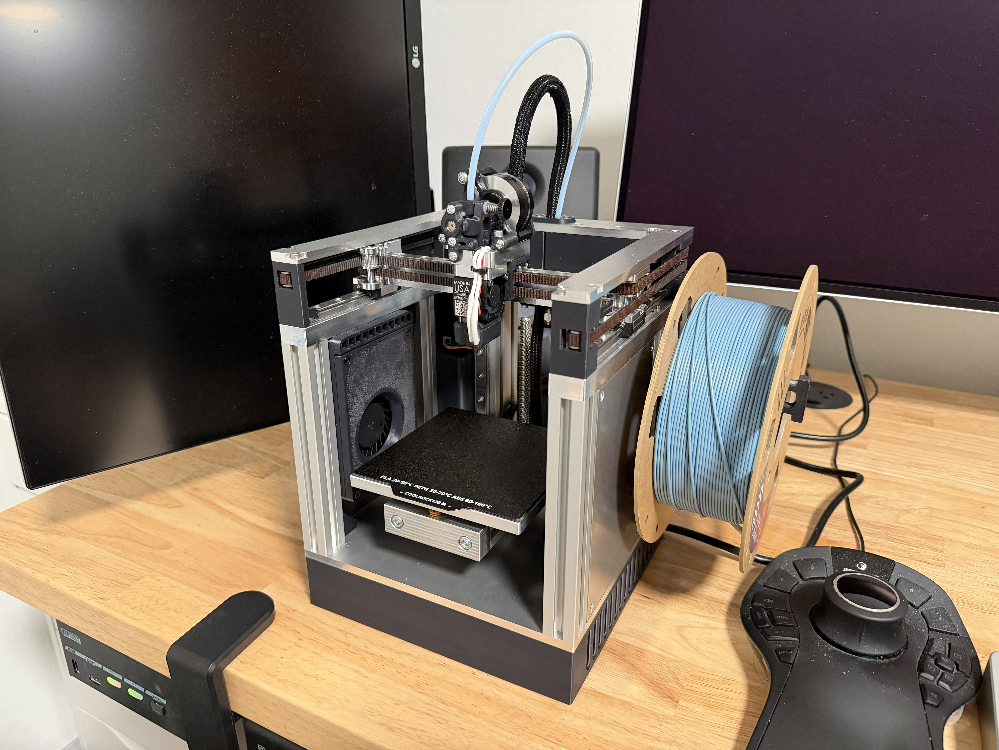
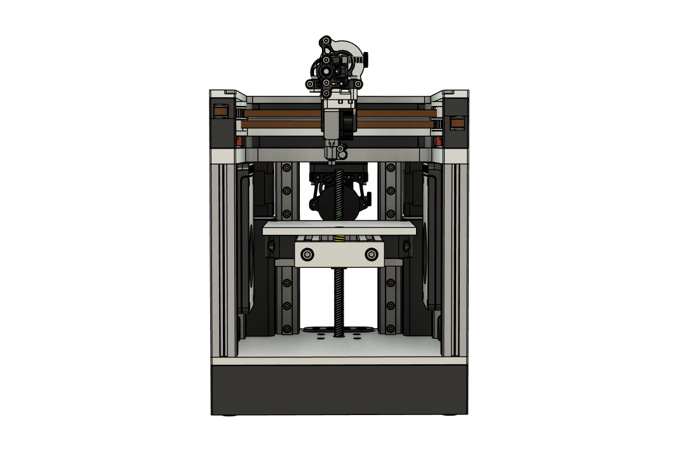

# Quicksilver

**Quicksilver** is a small 3D printer featuring:
  * 120mm x 120mm x 100mm build volume
    * *(with an offset bed)*
  * 200mm x 200mm footprint
  * CoreXY kinematics
  * Milled aluminum parts
  * NEMA17 XY motors
  * Sheet cooling
  * Options for Bowden extruder (Sherpa Mini) or direct extruder (Sherpa Micro)

## Dimensions

### Travel area

  * **X**: 120mm
  * **Y**: 123mm
  * **Z**: 102mm

### Outer dimensions

  * **Width**: 200mm
  * **Depth**: 200mm
  * **Height**: 300mm

## BOM

Bill of materials can be found at [BOM.md](BOM.md).

## Acknowledgements

  * @cbon123 for the basis for the sheet cooling modules

## License

Quicksilver is licensed under CC-BY-NC-SA-4.0. More details can be found at [LICENSE.md](LICENSE.md) and https://creativecommons.org/licenses/by-nc-sa/4.0/.

If you are interested in selling parts for Quicksilver, please contact @ruiqimao on Discord.

